<h1 align="center"></h1>

[Sekilas Tentang](#sekilas-tentang) | [Instalasi](#instalasi) | [Cara Pemakaian](#cara-pemakaian) | [Pembahasan](#pembahasan) | [Referensi](#referensi)
:---:|:---:|:---:|:---:|:---:


# Sekilas Tentang
[`^ kembali ke atas ^`](#)

[FocusStopWatch](https://github.com/hilmyveradin/focusstopwatch-vue) merupakan sebuah aplikasi web yang telah dirancang dengan tujuan utama untuk melakukan pemantauan dan pencatatan secara cermat mengenai sejauh mana kemampuan seseorang dalam menjaga tingkat fokusnya sebelum akhirnya mengalami distraksi atau kehilangan konsentrasi. Saat ini, situs FocusStopwatch.com dapat diakses melalui: http://172.245.185.120:3000/

# Instalasi
[`^ kembali ke atas ^`](#)

#### Kebutuhan Sistem :
- Virtual Private Server atau Virtual Machine berbasis Linux
- Git
- SSH Client
- Node Package Manager versi ^17
- Docker
- Docker Compose
- Nginx

#### Proses Instalasi :
1. Buat akses pada Virtual Machine atau Virtual Private Server. Jika menggunakan Virtual Private Server, gunakan perintah:
    ```
     ssh <USERNAME>@<IP ADDRESS> -p <PORT>
    ```
2. Pastikan Git terinstall di dalam sistem. Jika belum, gunakan perintah:
    ```
     sudo apt install git
    ```
3. Clone project ini GitHub. Dapat menggunakan perintah:
    ```
     git clone https://github.com/hilmyveradin/komdat-repo.git
    ```
4. Pindahkan direktori menuju komdat-repo. Dapat menggunakan perintah:
    ```
     cd komdat-repo
    ```
5. Buat file initialize.sh menjadi _executable_ dan ekekusi program initialize.sh. Gunakan perintah:
    ```
     chmod +x initialize.sh
     ./initialize.sh
    ```
6. FocusStopwatch.com dapat diakses melalui alamat ip dengan port 3000
    ```
     <IP ADDRESS>:3000
    ```


# Cara Pemakaian
[`^ kembali ke atas ^`](#)
Cara pemakaian aplikasi web FocusStopwatch termasuk mudah, karena. Berikut adalah lengkap nya : 
   1. Pada tampilan utama, terlihat interface yang mudah dimengerti. Kita perlu login ke dalam aplikasi.
      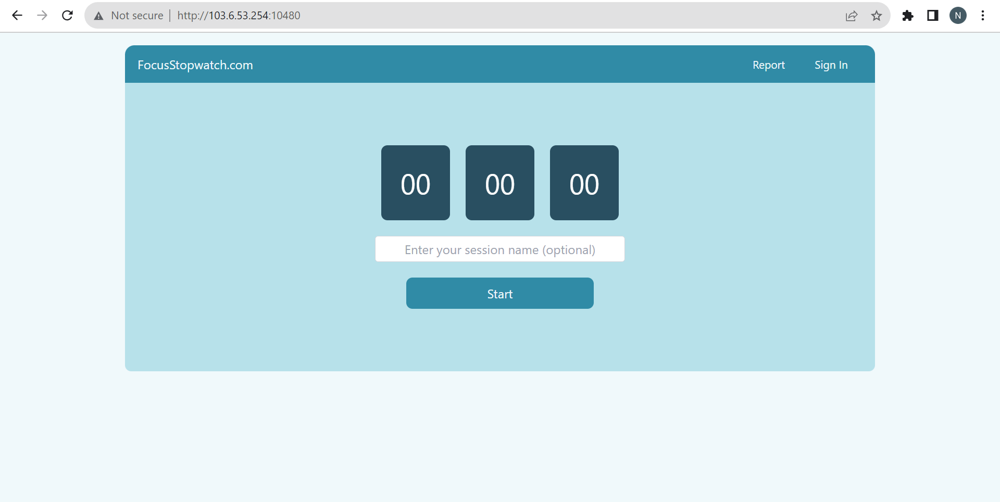
   2.  Kita perlu memasukkan email agar report hasil data bisa tersimpan
      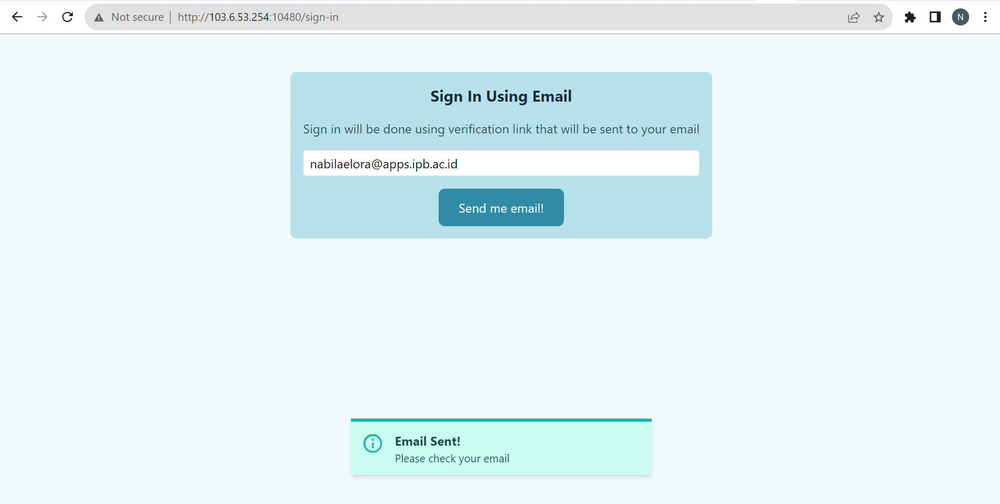
   3. Perlu dilakukannya confirm your mail untuk verifikasi email
      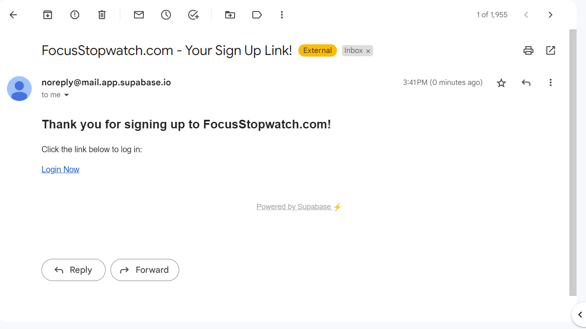
   4. Tampilan setelah login
      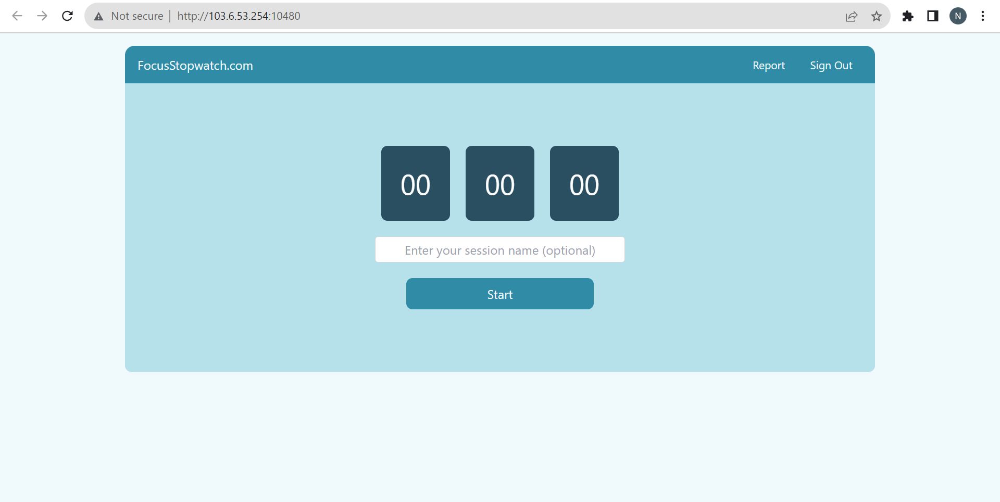
   5. Tekan tombol Start, maka stopwatch akan mulai bekerja
      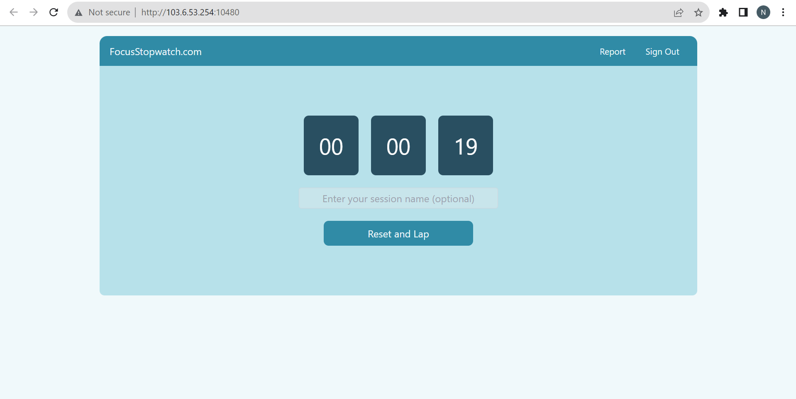
   6. Jika, sudah merasa terdistraksi, maka tekan tombol Reset and Lap. FocusStopwach akan mencatat seberapa lama waktu fokus.
       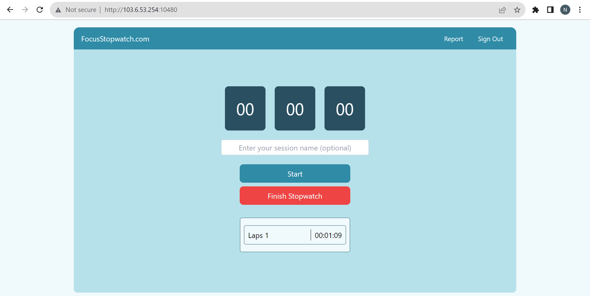
   7. Jika ingin memulai kembali, tekan tombol Start. Maka, lap 2 akan dimulai.
       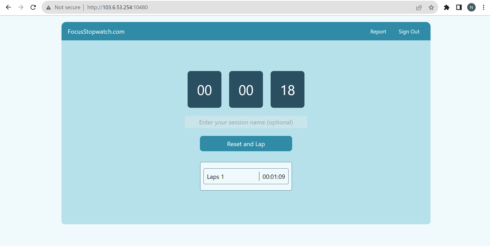
   8. Jika ingin mencatat hasil fokus pada lap 2, tekan tombol Reset and Lap kembali. Maka waktu fokus pada lap 2 akan tercatat.
       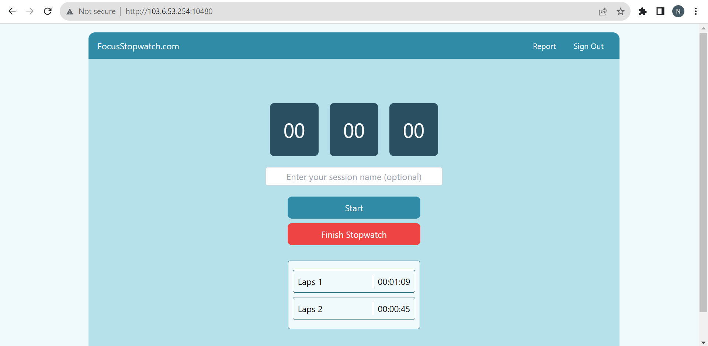
   9. Jika sudah selesai menggunakan FocusStopwatch, tekan tombol Finish Stopwatch untuk balik ke tampilan awal.
       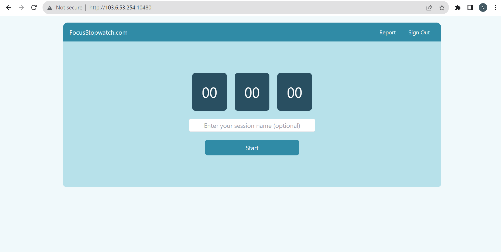
   10. Tekan tombol Report untuk melihat rekaman waktu fokus yang telah dijalankan
       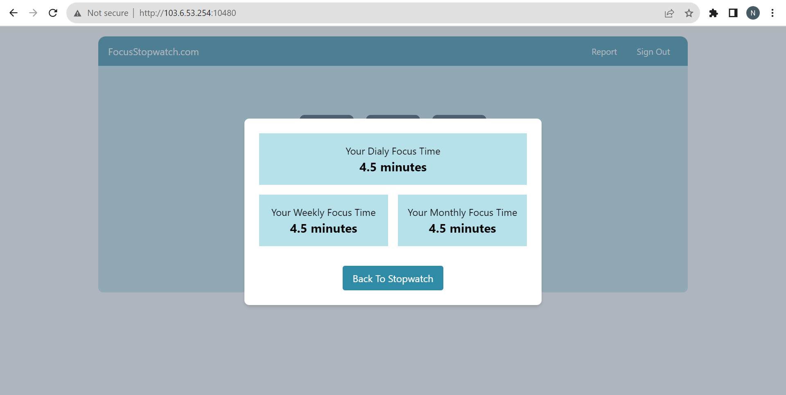

Dalam penggunaan aplikasi web FocusStopwatch, penting untuk melakukan proses Sign in. Tanpa melakukan Sign in, report (laporan) mengenai penggunaan aplikasi kita tidak akan terekam. Berikut adalah perbandingan tangkapan layar dari report (laporan) penggunaan tanpa Sign in.
   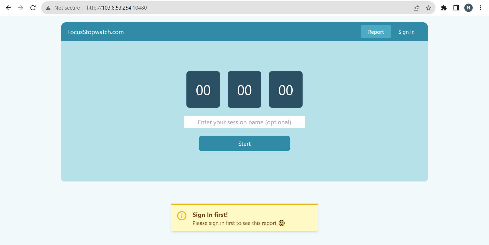


# Pembahasan
[`^ kembali ke atas ^`](#)

**FocusStopwatch** merupakan sebuah aplikasi web yang ditulis menggunakan `vue.js` dan `tailwind.css` untuk tampilannya, serta menggunakan `Supabase` untuk backend-nya. Aplikasi ini merupakan sejenis aplikasi stopwatch atau Pomodoro timer, dengan beberapa fitur berikut:

- Timer stopwatch yang waktu-nya dapat dipisah berdasarkan "session"
- Kustomisasi nama session
- Fitur "Report" untuk menunjukkan laporan statistik waktu fokus dari user

Sebagai perbandingan dengan aplikasi stopwatch, aplikasi lainnya yang mirip adalah *online stopwatch* oleh [**ChronMe**](http://online-stopwatch.chronme.com/). Berikut adalah beberapa perbedaan di antara kedua aplikasi:

- **ChronMe** lebih seperti stopwatch pada umumnya, yaitu ketika kita meng-klik "Lap", waktu pada stopwatch akan tetap berjalan. Smentara itu, **FocusStopwatch** lebih ditujukan pada tracking waktu fokus. Sehingga, ketika kita meng-klik "Reset and Lap", waktu pada stopwatch akan ke-reset.
- Tampilan waktu pada **ChronMe** juga menunjukkan milisekon, sedangkan **FocusStopwatch** hanya sampai sekon.
- **FocusStopwatch** memiliki fitur "Report" yang menampilkan statistik waktu fokus dari user, sedangkan **ChronMe** tidak.

Adapun untuk perbandingan dengan aplikasi Pomodoro timer, aplikasi yang mirip adalah [**PomoFocus.io**](https://pomofocus.io/). Berikut adalah beberapa perbedaan di antara kedua aplikasi:

- **PomoFocus.io** menggunakan konsep Pomodoro, sehingga timer-nya menghitung mundur dari 25 menit (atau 5 menit untuk break) sampai habis. Sementara itu, **FocusStopwatch** lebih mirip dengan stopwatch, yakni menghitung dari detik 0 dan terus naik.
- Pada aplikasi **PomoFocus.io**, terdapat perbedaan antara sesi fokus dan break. Sementara itu, **FocusStopwatch** hanya menghitung waktu pada sesi fokus.
- Pada aplikasi **PomoFocus.io**, terdapat fitur to-do-list untuk menulis task yang ingin kita lakukan. Fitur ini tidak ada pada **FocusStopwatch**.
- Pada aplikasi **PomoFocus.io**, fitur "Report" nya lebih lengkap. Terdapat grafik waktu fokus serta leaderboard untuk membandingkan jumlah waktu fokus kita dengan user yang lain. Fitur ini tidak ada pada **FocusStopwatch**.


# Referensi
[`^ kembali ke atas ^`](#)

1. [Docker](https://www.docker.com/)
2. [Nginx](https://www.nginx.com/)
3. [ChronMe](http://online-stopwatch.chronme.com/)
4. [Pomofocus](https://pomofocus.io/)
